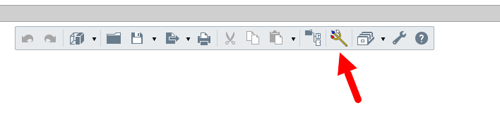

# VinnyRengaPlugin

Adapter for Renga

https://github.com/Vinny-Environment/VinnyRengaAdapter

# Установка

Файлы плагина к Renga расположены в папке `plugins\renga` пакета `VinnyLibConverter`(см. [здесь](https://github.com/Vinny-Environment/VinnyLibConverter#%D1%83%D1%81%D1%82%D0%B0%D0%BD%D0%BE%D0%B2%D0%BA%D0%B0))

Приложение собрано под 2 целевые среды: .NET8 и .NET Framework 4.8. 

Протестировано на версии Renga Standard 8.8. .NET8.

> Сборка под .NET Framework 4.8 не запускается (не может найти какие-то библиотеки). Возможно, она не рабочая в принципе. Надо попробовать на старых версиях.
> 
> Рекомендуется использовать сборку под .NET8

1. Зайти в папку с установленной Renga нужной версии (папка, в корне которой лежит приложение `Renga.exe`);

2. Создать при отсутствии папку `Plugins`;

3. Создать в ней папку `VinnyRengaAdapter`;

4. Скопировать в папку `VinnyRengaAdapter` в зависимости от целевой среды (.NET8 или .NET Framework) файл `VinnyRengaAdapter.rndesc` из `plugins\renga\net8.0-windows` или `plugins\renga\net48` соответственно;

5. Открыть скопированный файл `VinnyRengaAdapter.rndesc` и отредактировать XML-тэг `PluginFilename`, задав абсолютный файловый путь до `VinnyRengaLoader.dll`, куда вы распаковали `VinnyLibConverter` у себя на ПК в зависимости от целевой среды (.NET8 или .NET Framework);

Если всё сделано корректно, то при запуске Renga на панели инструментов появится кнопка плагина:

## Возможные обновления

Среда .NET8 -- https://dotnet.microsoft.com/en-us/download/dotnet/thank-you/sdk-8.0.413-windows-x64-installer
Среда .NET Framework 4.8 -- https://dotnet.microsoft.com/en-us/download/dotnet-framework/thank-you/net48-offline-installer

# Использование

Экспортируются только видимые на 3D-виде объекты. Если объект скрыт, то не будет экспортирован. Если скрыт уровень, то все объекты, привязанные к нему, не будут экспортированны.
